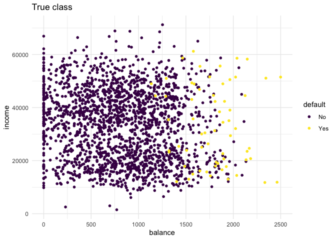
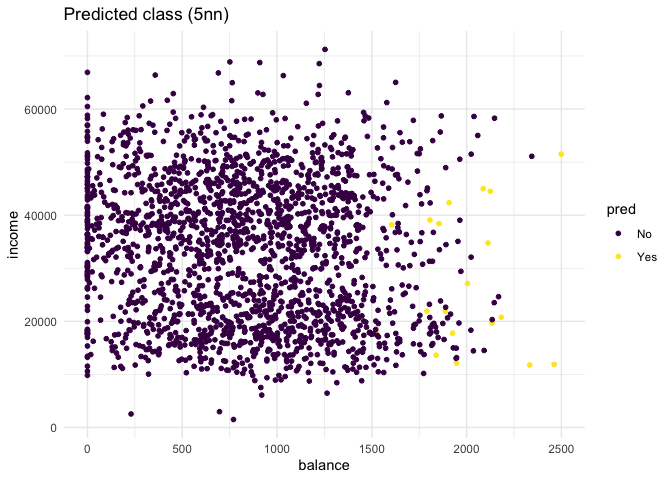
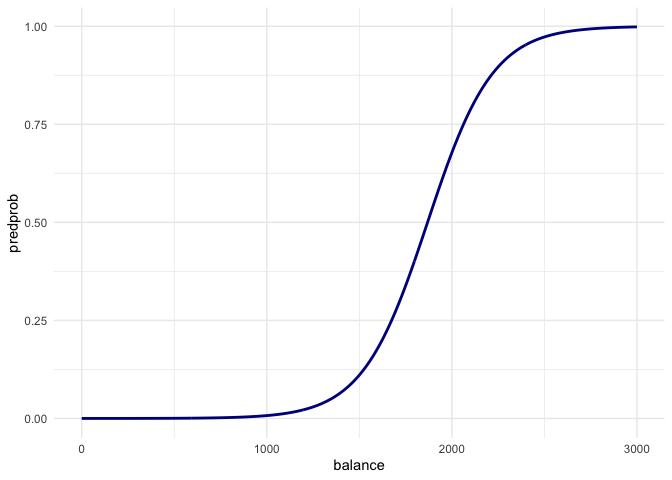

supervised_learning
================
Aline D’Intino

## Introduction

Goals: Learn and apply three different classification methods: K-nearest
neighbours, logistic regression, and linear discriminant analysis.

``` r
library(MASS)
library(class)
library(ISLR)
library(tidyverse)
```

    ## ── Attaching packages ─────────────────────────────────────── tidyverse 1.3.1 ──

    ## ✓ ggplot2 3.3.5     ✓ purrr   0.3.4
    ## ✓ tibble  3.1.6     ✓ dplyr   1.0.7
    ## ✓ tidyr   1.1.4     ✓ stringr 1.4.0
    ## ✓ readr   2.1.1     ✓ forcats 0.5.1

    ## ── Conflicts ────────────────────────────────────────── tidyverse_conflicts() ──
    ## x dplyr::filter() masks stats::filter()
    ## x dplyr::lag()    masks stats::lag()
    ## x dplyr::select() masks MASS::select()

## Default dataset

The default dataset contains credit card loan data for 10 000 people.
The goal is to classify credit card cases as yes or no based on whether
they will default on their loan.

Create a scatterplot of the Default dataset, where balance is mapped to
the x position, income is mapped to the y position, and default is
mapped to the colour. Can you see any interesting patterns already?

``` r
Default %>% 
  arrange(default) %>% # so the yellow dots are plotted after the blue ones
  ggplot(aes(x = balance, y = income, colour = default)) +
  geom_point(size = 1.3) +
  theme_minimal() +
  scale_colour_viridis_d() # optional custom colour scale
```

<!-- -->

``` r
# People with high remaining balance are more likely to default. 
# There seems to be a low-income group and a high-income group
```

Add facet_grid(cols = vars(student)) to the plot. What do you see?

``` r
Default %>% 
  arrange(default) %>% # so the yellow dots are plotted after the blue ones
  ggplot(aes(x = balance, y = income, colour = default)) +
  geom_point(size = 1.3) +
  theme_minimal() +
  scale_colour_viridis_d() +
  facet_grid(cols = vars(student))
```

<!-- -->

``` r
# The low-income group is students!
```

Transform “student” into a dummy variable using ifelse() (0 = not a
student, 1 = student). Then, randomly split the Default dataset into a
training set default_train (80%) and a test set default_test (20%)

``` r
default_df <- 
  Default %>% 
  mutate(student = ifelse(student == "Yes", 1, 0)) %>% 
  mutate(split = sample(rep(c("train", "test"), times = c(8000, 2000))))

default_train <- 
  default_df %>% 
  filter(split == "train") %>% 
  select(-split)

default_test <- 
  default_df %>% 
  filter(split == "test") %>% 
  select(-split)
```

## K-Nearest Neighbours

Create class predictions for the test set using the knn() function. Use
student, balance, and income (but no basis functions of those variables)
in the default_train dataset. Set k to 5. Store the predictions in a
variable called knn_5\_pred.

``` r
knn_5_pred <- knn(
  train = default_train %>% select(-default),
  test  = default_test  %>% select(-default),
  cl    = as_factor(default_train$default),
  k     = 5
)
```

Create two scatter plots with income and balance as in the first plot
you made. One with the true class (default) mapped to the colour
aesthetic, and one with the predicted class (knn_5\_pred) mapped to the
colour aesthetic. Hint: Add the predicted class knn_5\_pred to the
default_test dataset before starting your ggplot() call of the second
plot. What do you see?

``` r
# first plot is the same as before
default_test %>% 
  arrange(default) %>% 
  ggplot(aes(x = balance, y = income, colour = default)) +
  geom_point(size = 1.3) + 
  scale_colour_viridis_d() +
  theme_minimal() +
  labs(title = "True class")
```

<!-- -->

``` r
# second plot maps pred to colour
bind_cols(default_test, pred = knn_5_pred) %>% 
  arrange(default) %>% 
  ggplot(aes(x = balance, y = income, colour = pred)) +
  geom_point(size = 1.3) + 
  scale_colour_viridis_d() +
  theme_minimal() +
  labs(title = "Predicted class (5nn)")
```

<!-- -->

``` r
# there are quite some misclassifications: many "No" predictions
# with "Yes" true class and vice versa.
```

Repeat the same steps, but now with a knn_2\_pred vector generated from
a 2-nearest neighbours algorithm. Are there any differences?

``` r
knn_2_pred <- knn(
  train = default_train %>% select(-default),
  test  = default_test  %>% select(-default),
  cl    = as_factor(default_train$default),
  k     = 2
)

# second plot maps pred to colour
bind_cols(default_test, pred = knn_2_pred) %>% 
  arrange(default) %>% 
  ggplot(aes(x = balance, y = income, colour = pred)) +
  geom_point(size = 1.3) + 
  scale_colour_viridis_d() +
  theme_minimal() +
  labs(title = "Predicted class (2nn)")
```

<!-- -->

``` r
# compared to the 5-nn model, more people get classified as "Yes"
# Still, the method is not perfect
```

## Confusion matrix

``` r
table(true = default_test$default, predicted = knn_2_pred)
```

    ##      predicted
    ## true    No  Yes
    ##   No  1887   50
    ##   Yes   49   14

What would this confusion matrix look like if the classification were
perfect?

``` r
# All the observations would fall in the yes-yes or no-no categories; 
# the off-diagonal elements would be 0 like so:

table(true = default_test$default, predicted = default_test$default)
```

    ##      predicted
    ## true    No  Yes
    ##   No  1937    0
    ##   Yes    0   63

Make a confusion matrix for the 5-nn model and compare it to that of the
2-nn model. What do you conclude?

``` r
table(true = default_test$default, predicted = knn_5_pred)
```

    ##      predicted
    ## true    No  Yes
    ##   No  1926   11
    ##   Yes   55    8

``` r
# the 2nn model has more true positives (yes-yes) but also more false
# positives (truly no but predicted yes). Overall the 5nn method has 
# slightly better accuracy (proportion of correct classifications).
```

## Logistic regression

Use glm() with argument family = binomial to fit a logistic regression
model lr_mod to the default_train data.

``` r
lr_mod <- glm(default ~ ., family = binomial, data = default_train)
```

Visualise the predicted probabilities versus observed class for the
training dataset in lr_mod. You can choose for yourself which type of
visualisation you would like to make. Write down your interpretations
along with your plot.

``` r
tibble(observed  = default_train$default, 
       predicted = predict(lr_mod, type = "response")) %>% 
  ggplot(aes(y = predicted, x = observed, colour = observed)) +
  geom_point(position = position_jitter(width = 0.2), alpha = .3) +
  scale_colour_manual(values = c("dark blue", "orange"), guide = "none") +
  theme_minimal() +
  labs(y = "Predicted probability to default")
```

<!-- -->

``` r
# I opted for a raw data display of all the points in the test set. Here,
# we can see that the defaulting category has a higher average probability
# for a default compared to the "No" category, but there are still data 
# points in the "No" category with high predicted probability for defaulting.
```

Look at the coefficients of the lr_mod model and interpret the
coefficient for balance. What would the probability of default be for a
person who is not a student, has an income of 40000, and a balance of
3000 dollars at the end of each month? Is this what you expect based on
the plots we’ve made before?

``` r
coefs <- coef(lr_mod)
coefs["balance"]
```

    ##     balance 
    ## 0.005654811

``` r
# The higher the balance, the higher the log-odds of defaulting. Precisely:
# Each dollar increase in balance increases the log-odds by 0.0058.

# Let's calculate the log-odds for our person
logodds <- coefs[1] + 4e4*coefs[4] + 3e3*coefs[3]

# Let's convert this to a probability
1 / (1 + exp(-logodds))
```

    ## (Intercept) 
    ##   0.9983321

``` r
# probability of .998 of defaulting. This is in line with the plots of before
# because this new data point would be all the way on the right.
```

## Visualising the effect of the balance variable

Create a data frame called balance_df with 3 columns and 500 rows:
student always 0, balance ranging from 0 to 3000, and income always the
mean income in the default_train dataset.

``` r
balance_df <- tibble(
  student = rep(0, 500),
  balance = seq(0, 3000, length.out = 500),
  income  = rep(mean(default_train$income), 500)
)
```

Use this dataset as the newdata in a predict() call using lr_mod to
output the predicted probabilities for different values of balance. Then
create a plot with the balance_df$balance variable mapped to x and the
predicted probabilities mapped to y. Is this in line with what you
expect?

``` r
balance_df$predprob <- predict(lr_mod, newdata = balance_df, type = "response")

balance_df %>% 
  ggplot(aes(x = balance, y = predprob)) +
  geom_line(col = "dark blue", size = 1) +
  theme_minimal()
```

<!-- -->

``` r
# Just before 2000 in the first plot is where the ratio of
# defaults to non-defaults is 50-50. So this line is exactly what we expect!
```

Create a confusion matrix just as the one for the KNN models by using a
cutoff predicted probability of 0.5. Does logistic regression perform
better?

``` r
pred_prob <- predict(lr_mod, newdata = default_test, type = "response")
pred_lr   <- factor(pred_prob > .5, labels = c("No", "Yes"))

table(true = default_test$default, predicted = pred_lr)
```

    ##      predicted
    ## true    No  Yes
    ##   No  1929    8
    ##   Yes   42   21

``` r
# logistic regression performs better in every way than knn. This depends on
# your random split so your mileage may vary
```

## Linear discriminant analysis

Train an LDA classifier lda_mod on the training set.

``` r
lda_mod <- lda(default ~ ., data = default_train)
```

Look at the lda_mod object. What can you conclude about the
characteristics of the people who default on their loans?

``` r
lda_mod
```

    ## Call:
    ## lda(default ~ ., data = default_train)
    ## 
    ## Prior probabilities of groups:
    ##      No     Yes 
    ## 0.96625 0.03375 
    ## 
    ## Group means:
    ##       student   balance   income
    ## No  0.2909444  801.3364 33624.86
    ## Yes 0.3777778 1739.4480 31793.54
    ## 
    ## Coefficients of linear discriminants:
    ##                   LD1
    ## student -2.302556e-01
    ## balance  2.252129e-03
    ## income   1.614977e-06

``` r
# defaulters have a larger proportion of students that non-defaulters 
# (40% vs 29%), they have a slightly lower income, and they have a 
# much higher remaining credit card balance than non-defaulters.
```
